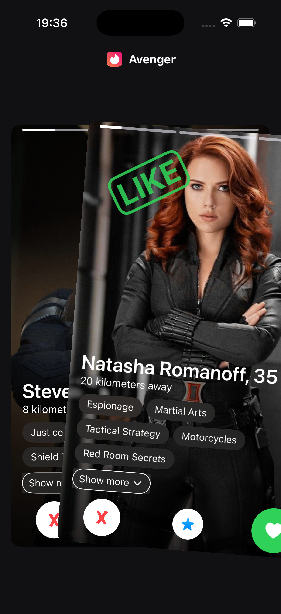

<p align="center">
  
</p>

<h1 align="center">Avenger Match</h1>

<p align="center">
  A Tinder-style swipe deck built with SwiftUI — themed around the Marvel Avengers.
</p>

<p align="center">
  
  
  
  
</p>

---

## Screenshots

### Main deck

<div style="display: flex; flex-direction: row; gap: 12px;">
  
  
  
</div>

---

## Features

- **Swipe deck** — swipe right to like, left to pass; spring-animated card rotation and removal
- **Auto-advancing carousel** — top card cycles through photos on a timer
- **Zoom transition** — tap a card to open the profile with a native iOS 18 hero animation
- **Fullscreen photo viewer** — drag down to dismiss; matched-geometry transition
- **Interest pills** — custom flow layout with highlighted "matched" tags
- **Liquid Glass UI** — native iOS 26 materials throughout the interface
- **Dark mode support** — fully adaptive color scheme

---

## Tech stack

| Layer | Technology |
|---|---|
| UI | SwiftUI |
| State | `@Observable` / Observation framework |
| Navigation | `NavigationStack` + custom `NavigationManager` |
| Transitions | `matchedTransitionSource` · `matchedGeometryEffect` · `.navigationTransition(.zoom)` |
| Layout | Custom `Layout` (flow/tag layout) |
| Materials | iOS 26 `glassEffect` |

---

## Requirements

- Xcode 26+
- iOS 26.0+

---

## Build

```bash
xcodebuild -project TinderClone.xcodeproj -scheme TinderClone \
  -destination 'platform=iOS Simulator,name=iPhone 16' build
```

---

## Development process

This project was built in close collaboration with [Claude](https://claude.ai) using a structured, plan-driven workflow:

1. **Planning** — Claude Opus 4.7 (max effort) produced a detailed implementation plan covering architecture, API choices, and edge cases
2. **Review** — the plan was reviewed and validated by the author before any code was written
3. **Execution** — Claude Sonnet 4.6 (max effort) executed the approved plan, with the author overseeing each step

The repository includes a [`CLAUDE.md`](CLAUDE.md) file that documents project conventions, architecture decisions, and guidance for future AI-assisted sessions.
